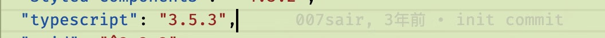

# TypeScript 在 JDV 的实践应用

## 关于分享

### 动机

jdv editor first git commit

使用 TS 已经 3 年时间，微信公众号、掘金、知乎、收藏夹甚至抖音...收（落）藏（灰）了很多关于 TS 的文章，从入门到进阶。

时间久了后，很多文章自动过期（大占比是版本太旧、少占比是自己 get 了）。

借此分享机会，一边梳理、一边回忆，整理了以下的分享内容。

### 分享方式

初始化了一个 React + TS 的项目，以 TS 的 playground（代码演示工具） 为主，当前项目为辅，演示分享内容。

## TS 使用情况

- JDV 编排系统
- JDV 后台管理系统
- JDV 工具集
- 数据流
- 榜单后台系统

## 为什么要使用 TS

#### 优点

- 提升开发效率、代码质量
  - 智能提示、语法错误检查、跳转定义
  - 问题前置，降低运行时的 bug
- 提升代码可维护性、可读性
  - 类型即文档 [formik-form-render](https://github.com/007sair/formik-form-render)
  - 利于重构
- 最新的 JavaScript 特性
- 完善的生态支持（文档、@types、eslint、IDE、babel 等..）

#### 缺点

- 学习成本
- 开发成本

#### 收益

- 思维方式的转变
- 使用 TS 过程 = 学习过程（关注底层代码、框架源代码的实现）
- 团队协作效率提升
- 开发体验、信心度提升

> 是否需要使用 TS 需要结合项目规模、周期、团队规模、成员情况而定。
> 千万不要为了用而用，最后变成 anyScript 。
